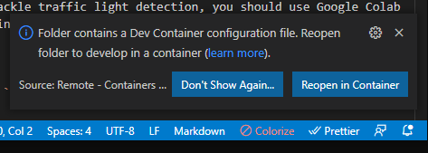

# Connected and Autonomous Driving - Final Project

This project is based off the Open Source Unity Simulator from Udacity and its [Self-Driving Car Nanodegree Capstone Project](https://github.com/udacity/CarND-Capstone). Some modifications and customizations have been introduced by us, so don't try to blindly copy existing solutions you might find online.

This document introduces the software environment and the way to use the VSCode editor to access a preconfigured docker container and get up and running very quickly.

## Platform support

Both Linux and MacOS are supported out of the box. Windows is supported through WSL2, so make sure you have a valid [WSL 2 installation with Docker](https://docs.docker.com/desktop/windows/wsl/) before you start using the project, or use a Linux VM.

## Running the simulator and the Docker container

### Running the simulator

1. Download the [latest version of the simulator](https://github.com/udacity/CarND-Capstone/releases/tag/v1.3) for your host system (Windows, MacOS or Linux), unzip it.
1. Running the `sys_int` executable should display a window where you can pick screen resolution and graphics quality. Select "1024x728" at most and "Fastest", then press "Play" to start the simulator.
1. We will be working with the "Highway" environment
1. You should be able to move the car using the arrow keys.

#### Running the Docker Container

The simulator acts as a server to which a client can connect to communicate. Communication to the client will consist in the state of the simulation (position of objects, speed, etc), and the server will expect to receive commands from the client to control the car.

To avoid mismatches in software versions, we will be developping and running the client code within Docker (the simulator will not run inside Docker). You don't need to know much about Docker to use it in this project, but since it is a widely used technology in the industry, you should [get familiar with it](https://docs.docker.com/get-started/). Make sure Docker works on your machine by running

```bash
docker run --rm hello-world
```

#### Attaching VSCode to the Container

Start VSCode and open this project. VSCode might suggest to install some recommended extensions, accept this and reload VSCode. It will also suggest opening the project in a container, you should also accept this. This will let VSCode start the container with all the right settings so you don't have to worry about it.



If the popup to reopen in container does not show, you can manually trigger this using CTRL+SHIFT+P and typing "Reopen folder in container"


#### Compiling the project

The code for all the nodes is located in `/host/ros`, so you should open an integrated terminal ("Terminal > New Terminal") and compile the code using

```bash
cd /host/ros
catkin_make
```

The `catkin_make` command will compile all the ROS packages that are declared under `/host/ros` and should be successful before you modify anything. Since most nodes are written in Python, they are not actually compiled, but ROS is merely doing some notekeeping about them.

If you are experiencing strange issues with compilation, it might help to clear the compilation cache by running `rm -rf /host/ros/build /host/ros/devel` and compiling again.

#### Running the Code

In ROS, you may run any specific node using either `rosrun`, or `roslaunch` with the corresponding `.launch` file. We provide a launchfile to run all the required nodes at once, but you might want to run only a subset of the nodes when debugging.

We will run your project using `/host/ros/launch.sh`, so don't change `launch.sh` but feel free to create another similar script to run a custom launch file that would start only a subset of the nodes for debugging and testing.

## Frequently Asked Questions

### Is GPU support enabled in the containers

Accessing GPUs is not supported out-of-the-box because it is still hard to support on all platforms. Linux users that are comfortable with Docker can enable their GPU(s) using `--gpus=all` in the docker call from `run.sh`. We expect your code to run on a decent CPU, there should be no need to leverage the GPU at inference. If you choose to tackle traffic light detection, you should use Google Colab to train your model, but don't forget to include the training code/notebook in your submission.

### How can I change the speed limit (speed of track waypoints)

The speed limit, ie. the target speed for track waypoints, can be changed in `ros/src/sim_bridge/waypoint_loader/launch/waypoint_loader.launch` (default 50 km/h).

### Tips for debugging ROS Nodes

- You can create additional topics to publish your debug information like intermediate results
- Printing is not the best idea, but will work if using `output=screen` in launch files
- You can use ROSBAGs to record specific topics and replay them. This can allow you to run a single node by providing its inputs without running the full pipeline when debugging
